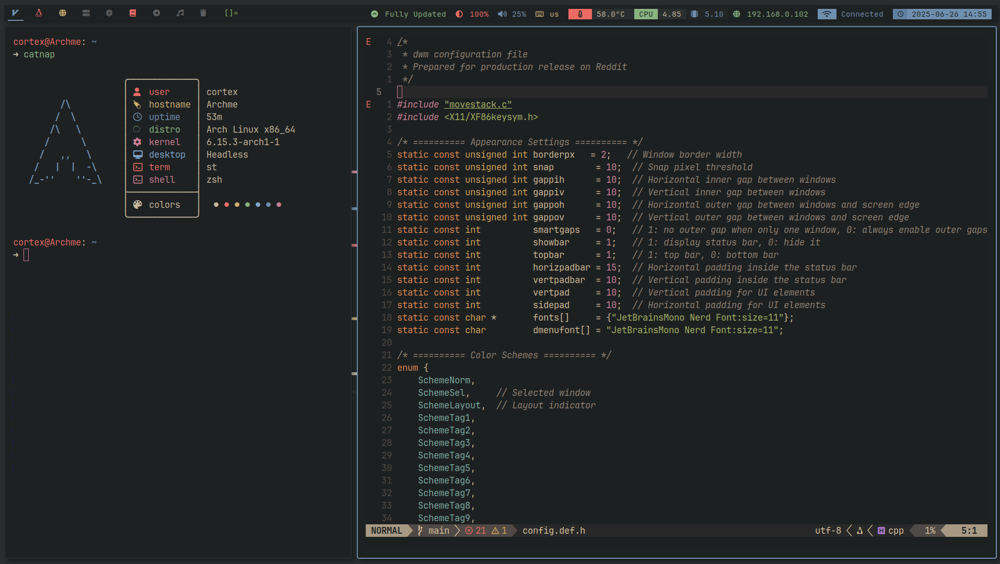

# AxisDWM

[](https://github.com/df1gg/axis-dwm/stargazers) [](https://github.com/df1gg/axis-dwm/blob/main/LICENSE)

> 💠 **AxisDWM**: A minimal, keyboard-driven dwm fork with a pastel Gruvbox‑Catppuccin hybrid theme, sensible defaults, and an elegant, info‑rich status bar.

<p align="center">
  
</p>

## 🔥 Why AxisDWM?

* **Sleek Aesthetics**: Warm pastel tones inspired by Gruvbox and Catppuccin make your workspace a joy to use.
* **Performance‑First**: Hand‑patched dwm keeps your system responsive and lightning‑fast.
* **Out‑of‑the‑Box Usability**: Thoughtful defaults and ergonomic keybindings let you dive straight into work.
* **Modular Status Bar**: Easily extend or swap modules to display volume, brightness, Wi-Fi, updates, and more.

## ✨ Highlights

| Feature                      | Description                                                                                          |
| ---------------------------- | ---------------------------------------------------------------------------------------------------- |
| 🎨 **Color Scheme**          | Gruvbox‑Catppuccin hybrid with customizable accents.                                                 |
| 🧩 **Patched dwm**           | Includes `status2d`, `vanitygaps`, `movestack`, `barpadding`, `notitle`, `underline-tags`, and more. |
| 🖥️ **Tag Icons**            | Semantic workspaces with Nerd Font icons for code, browsing, chat, etc.                              |
| 🏷️ **Intelligent Rules**    | Auto‑assign apps (Firefox, Telegram, Obsidian) to specific tags.                                     |
| 📊 **Dynamic Status Bar**    | Bash‑based script with modules for system stats, package updates, and notifications.                 |
| ⌨️ **Ergonomic Keybindings** | Super‑key driven commands for window management, layouts, and scripts.                               |

## 📦 Installation

1. **Clone repository**

   ```bash
   git clone https://github.com/df1gg/axis-dwm.git ~/.config/axisdwm
   cd ~/.config/axisdwm
   ```
2. **Install dependencies (Arch Linux)**

   ```bash
   sudo pacman -S --needed base-devel xorg xorg-xinit libx11 libxft libxinerama \
     xorg-xsetroot alsa-utils lm_sensors libxkbfile brightnessctl pamixer flameshot slock nerd-fonts-jetbrains-mono
   ```
3. **Build and install**

   ```bash
   sudo make clean install
   ```
4. **Enable in `.xinitrc`**

   ```bash
   exec dwm
   ```
5. **Start**

   ```bash
   startx
   ```

> Tip: Use your favorite display manager by pointing its session file to this configuration.

## ⚙️ Usage & Configuration

* **Keybindings**: See [`config.h`](config.h) for a complete list. Common shortcuts:

  * `Super+Enter`: Launch your default terminal (`st`)
  * `Super+p`: dmenu
  * `Super+Shift+c`: Close window
  * `Super+j/k`: Navigate windows
  * `Super+Space`: Cycle layouts

* **Status Bar**: Modify [`scripts/status.sh`](scripts/status.sh) to add/remove modules. Use `^c`/`^b` for color control.

* **Customize Bar Colors**: Edit [`scripts/bar_themes/gruvbox`](scripts/bar_themes/gruvbox) to tweak palette.

## 📸 Screenshots




## 🤝 Contributing

1. Fork the repo
2. Create a feature branch (`git checkout -b feature/awesome`)
3. Commit your changes (`git commit -m "Add awesome feature"`)
4. Push to the branch (`git push origin feature/awesome`)
5. Open a Pull Request 🚀

## 🎖️ Getting Support

* Report issues or request features via GitHub Issues

## 📜 License

AxisDWM is MIT licensed. See [LICENSE](LICENSE) for details.

---

> Ready to transform your Linux experience? ⭐ **Star this repo** and let AxisDWM become the centerpiece of your workflow!
